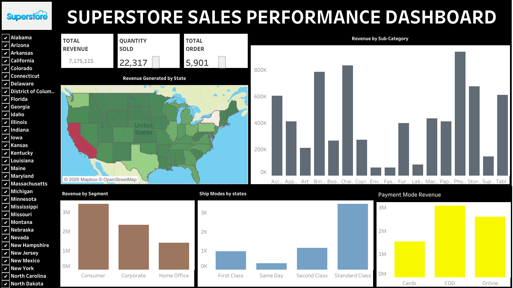

# SUPERSTORE SALES PERFORMANCE ANALYSIS

## BUSINESS TASK STATEMENT
**Analyzing the sales rate and revenue generation of the superstores across states in the United States** 

## EXECUTIVE SUMMARY
The primary goal of this analysis is to evaluate the sales performance, profitability, and customer behavior of Superstore across different US states. The insights derived will support strategic decisions aimed at improving revenue, optimizing inventory, and increasing profitability.
This Project Showcases
1. Data cleaning and transformation with Excel & Power Query
2. Strategic business thinking and insight generation
3. Data storytelling using interactive Tableau dashboards

### MAJOR POINT FOR ANALYSIS
1.  Which U.S. states generate the highest and lowest revenue?
2.  What product categories and sub-categories are driving revenue?
3.  Which regions or customer segments are most valuable?

### DATA SOURCE
**[SuperStore Sales Raw Dataset](SuperStore-Sales-DataSet.xlsx)**

## ANALYSIS PROCEDURE

### DATA PREPARATION, CLEANING AND EXPLORATORY DATA ANALYSIS (EDA) USING EXCEL AND POWER QUERY
1. First, I checked the dataset to know the relevant columns for this analysis
2. I checked for null or blank rows. I had non
3. I checked and removed duplicate values
4. Uploading the datasets on Power Query.
5. I removed the columns to only those relevant for the analysis
6. I added a revenue generated column (Sales*Quantity) and shipping days.
7. The columns were formatted to the suitable data types.
8. The cleaned dataset was uploaded to Tableau for proper analysis and Visualization.

**[CLEANED DATASET FOR ANALYSIS](US-Border-Crossing-Cleaned-Dataset.xlsx)**

### VISUALIZATION ON TABLEAU

**[Tabeau Visualization Link](https://public.tableau.com/views/SuperstoreSalesPerformanceDashboard_17438202256240/Dashboard1?:language=en-US&:sid=&:redirect=auth&:display_count=n&:origin=viz_share_link)**

## MAJOR FINDINGS
1. California, New York, Texas, and Washington were the top 4 highest revenue-generating states in the US.
2. The top 4 subcategories of items being purchased range from Phones, chairs, binders, and storage. This suggests that work-from-home jobs might be on the increase.
3. In the customer segment, the Consumer segment had the highest number of orders. Corporate customers contributed more to average revenue per transaction.
4. People mostly preferred Cash on delivery (COD) compared to online payments and the use of cards. The reason might be to be sure that what they ordered is what they receive.
5. People used standard class as the shipping mode because it is relatively cheap and also delivers within 4-7 days of the order.

## MY RECOMMENDATIONS

These are my recommendations:
1.  Speed up shipping timelines, especially for high-value customers using Standard Class
2.  Offer better discounts to Corporate buyers in low-performing states to boost volume
3.  Shift focus to high-margin subcategories like Chairs and Technology accessories
4.  Monitor regional KPIs monthly using a centralized dashboard
5.  Target the Online and Corporate segments in marketing campaigns 

